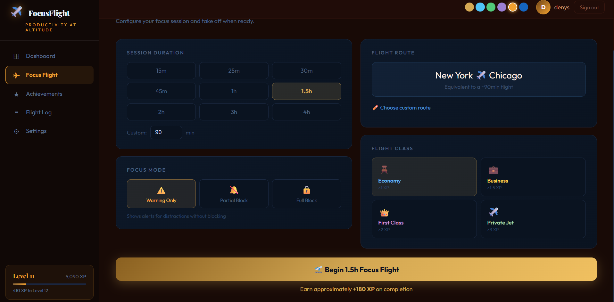
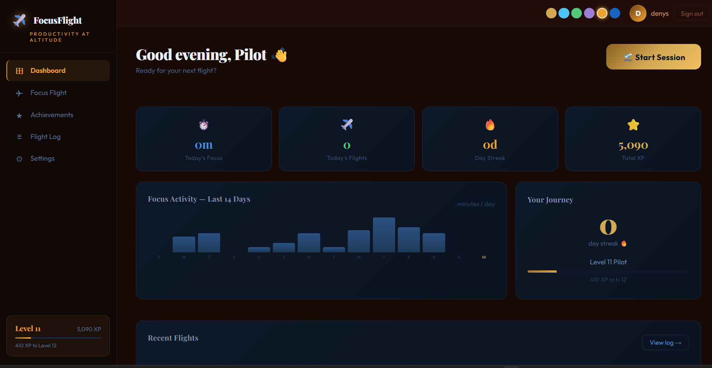
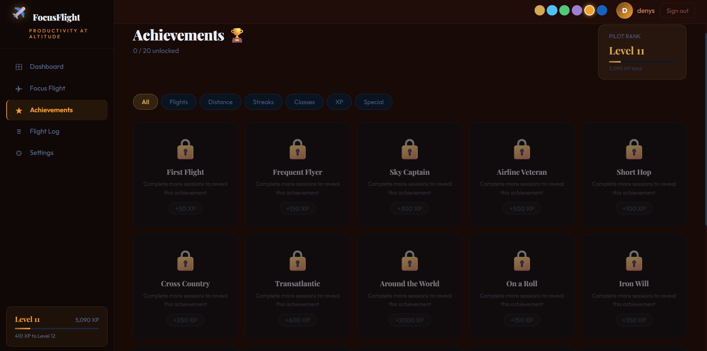
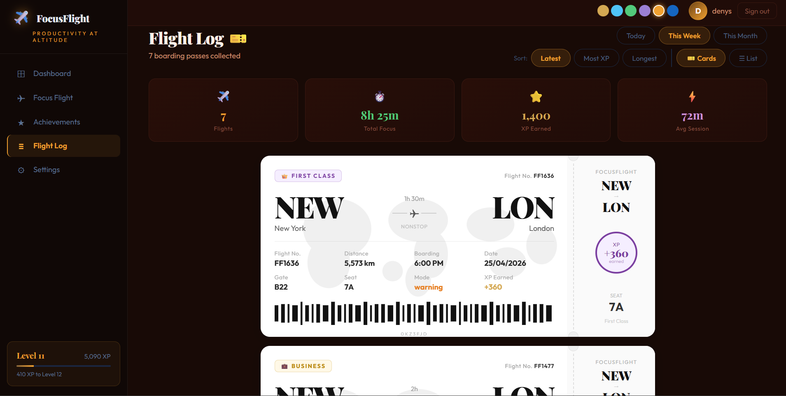
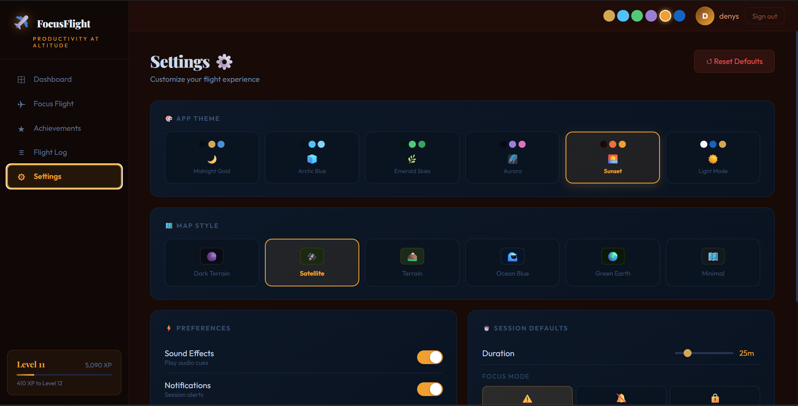

# ✈️ FocusFlight v2.0



**Productivity at Altitude** — A gamified focus and time-management app that turns every study or work session into a virtual flight journey.

---

## 🚀 Quick Start

```bash
# 1. Clone the repository
git clone https://github.com/YOUR_USERNAME/focusflight.git
cd focusflight

# 2. Install dependencies
npm install

# 3. Run in development mode
npm run dev
```

## 📦 Building

To build the standalone Electron application:

```bash
# Build for Windows (Portable)
npm run electron:build
```

## 🛠️ Built With

*   **Frontend**: [React](https://reactjs.org/) (Hooks & Functional Components)
*   **Build Tool**: [Vite](https://vitejs.dev/)
*   **Desktop Wrapper**: [Electron](https://www.electronjs.org/)
*   **Styling**: Custom CSS-in-JS design tokens
*   **Fonts**: Playfair Display & Outfit (via Google Fonts)

---

## 📁 Full File Structure

```
focusflight/
├── index.html
├── package.json
├── vite.config.js
├── electron/
│   └── main.cjs              # Electron main process
└── src/
    ├── main.jsx              # React entry point
    ├── App.jsx               # Root component
    ├── styles.js             # Global CSS injection + design tokens
    │
    ├── data/
    │   ├── flights.js        # Routes, cities, flight classes, XP formula
    │   └── achievements.js   # All achievement definitions
    │
    ├── hooks/
    │   └── useAppState.js    # Central state management
    │
    ├── utils/
    │   └── utils.js          # Formatting, XP, streak, seed data helpers
    │
    ├── components/
    │   ├── Sidebar.jsx       # Left nav, level card
    │   ├── Overlays.jsx      # Toasts, achievement popup, XP floater
    │   └── Onboarding.jsx    # Intro modal
    │
    └── views/
        ├── HomeView.jsx       # Dashboard
        ├── FocusView.jsx      # Session config + timer
        ├── AchievementsView.jsx
        ├── HistoryView.jsx    # Flight log
        └── SettingsView.jsx
```

---

## ✨ Features

### 1. Timer / Session Selection

- Preset durations: 15, 25, 30, 45, 60, 90, 120, 180, 240 min
- Custom duration input (5–480 min)
- Each duration mapped to a real-world flight route (e.g., 25min = London→Paris)
- Optional custom route selection from 50+ world cities
- Live XP preview before starting

### 2. Focus Mode

| Mode | Icon | Behavior |
|------|------|----------|
| Warning Only | ⚠️ | Shows alerts, no blocking |
| Partial Block | 🔕 | Filters specific distractions |
| Full Block | 🔒 | Strict lockdown mode |

### 3. Flight Classes & XP Multipliers
| Class | Unlock | Multiplier |
|-------|--------|------------|
| Economy ✈️ | Always | ×1.0 |
| Business 💼 | 500 XP | ×1.5 |
| First Class 👑 | 1,500 XP | ×2.0 |
| Private Jet ✈️ | 5,000 XP | ×3.0 |

### 4. Flight Phase Visualization
During a session, progress through 7 real flight phases:
`Pre-flight → Taxi → Takeoff → Climbing → Cruising → Descent → Landing`

Each phase has an animated icon tracker.

### 5. Achievements (20 total)

- **Flights:** First Flight, Frequent Flyer, Sky Captain, Airline Veteran
- **Distance:** Short Hop, Cross Country, Transatlantic, Around the World
- **Streaks:** On a Roll (3d), Iron Will (7d), Unstoppable (30d)
- **Classes:** Business, First, Private unlock badges
- **XP:** High Flyer, Jet Setter, Legendary Pilot
- **Special:** Long Haul (2h+ session), Early Bird (<8am), Night Owl (>10pm)

### 6. Dashboard
- Today's focus time, flight count, streak, total XP
- 14-day activity bar chart (today highlighted in gold)
- Level progress card with XP to next level
- Recent sessions list

### 7. Flight Log (History)

- Day / Week / Month filter
- Per-session: route, date, duration, flight class chip, XP earned
- Aggregate stats: total flights, focus time, XP, avg session

### 8. Settings

- Sound & notification toggles
- Default session duration slider
- Default focus mode
- Default flight class
- Default route (from/to city)
- Full reset to defaults

### 9. Onboarding
5-step guided modal on first launch explaining:
the flight metaphor, session setup, focus modes, XP system, and getting started.

---

## 🗺️ Custom Map Styles

Choose from multiple map themes to suit your focus environment.

| Midnight | Satellite | Topographic | Navigation |
|:---:|:---:|:---:|:---:|
|  |  |  |  |

> *Toggle between different aesthetic styles to keep your workspace fresh.*

---

## 🎨 Design System

**Palette:** Deep midnight navy + warm gold accents
| Token | Value | Use |
|-------|-------|-----|
| `--bg` | `#070C18` | App background |
| `--surface` | `#0D1828` | Cards |
| `--gold` | `#D4A853` | Primary accent |
| `--blue` | `#4A90D9` | Info/timer |
| `--green` | `#52C97A` | Success |

**Fonts:** `Playfair Display` (display/headers) + `Outfit` (body) via Google Fonts

**Animations:** fadeUp, popIn, float, goldPulse, shimmer, xpFloat, slideRight

---

## 🧮 XP Formula

```
XP = duration(min) × 2 × class_multiplier
```

Achievement bonus XP is added on top when unlocked.

---

## 🔧 Customization

### Add a flight route
In `src/data/flights.js`, add to `FLIGHT_ROUTES`:
```js
{ duration: 35, from: "Zurich", to: "Vienna", distance: 600, emoji: "🇨🇭→🇦🇹" }
```

### Add an achievement
In `src/data/achievements.js`, add to `ACHIEVEMENT_DEFS`:
```js
{
  id: "speed_runner",
  title: "Speed Runner",
  desc: "Complete 3 sessions in one day",
  icon: "⚡",
  xp: 200,
  category: "special",
  condition: (s) => s.todaySessions >= 3,
}
```

### Change XP per level
In `src/utils/utils.js`, change:
```js
export const XP_PER_LEVEL = 500; // default
```

---


## 🌊 User Flows

### Starting a session
1. Dashboard → click "Start Session" → navigates to Focus tab
2. Choose duration, focus mode, flight class, route
3. Click "Begin Focus Flight"
4. Timer starts → phases advance → XP preview shown
5. On completion → XP awarded → achievement check → toast + overlay

### Unlocking an achievement
1. Complete sessions until condition is met
2. Achievement popup animates in with icon + title + XP
3. Toast notification fires simultaneously
4. Achievement shown as "EARNED" in Achievements tab

---

> *"Every focus session is a flight. Stay in the air."* ✈️

